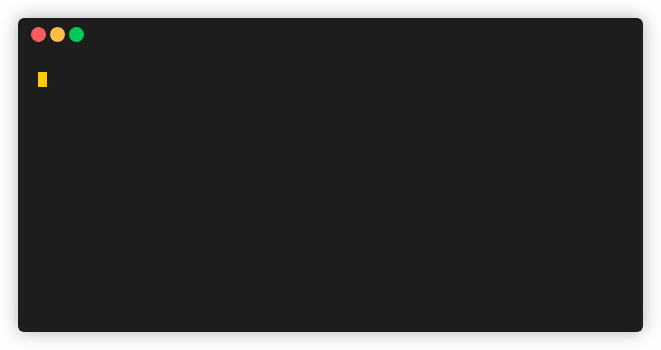

# await
68K, small memory footprint, single binary that run list of commands in parallel and waits for their termination

<!-- DO NOT CHANGE THIS FILE IS GENERATED BY ./hooks/pre-commit -->

# 

**Platform support:** Linux and macOS only

### install
```bash
# recommended way (crossplatform)
stew i slavaGanzin/await  # https://github.com/marwanhawari/stew
# or
eget slavaGanzin/await --to /usr/local/bin/  # https://github.com/zyedidia/eget

# nix
nix-shell -p await

# arch
yay -S await

# not recommended, but it works!
curl https://i.jpillora.com/slavaGanzin/await! | bash
```

### update
```bash
await --update
```
Downloads the latest release for your OS and CPU (a static build on Linux, so it runs on any distro), verifies its checksum, checks that it runs, then swaps it in and keeps the previous binary as `<path>.old`. If anything fails, you stay on the version you have. Installs managed by Nix, Homebrew or pacman/AUR are left to those tools, and a directory you can't write to gets a `sudo` hint.

In an interactive terminal await checks for a new release in the background once a day and tells you when one is out. `AWAIT_AUTO_UPDATE=1` makes that check install it too; `AWAIT_NO_UPDATE_CHECK=1` turns the check off.

### completions
Install shell completions automatically for all detected shells:
```bash
await --autocompletions
```

This command will detect which shells (bash, zsh, fish) are installed and automatically install completions for each one, providing status feedback for each shell:

```
Detecting installed shells and installing completions...

✓ bash found
  → completions installed to ~/.bashrc
✓ zsh found
  → completions installed to ~/.zshrc
✗ fish not found

Autocompletions installation complete!
```

Alternatively, install completions manually for specific shells:
```bash
# bash
await --autocomplete-bash >> ~/.bashrc

# zsh
await --autocomplete-zsh >> ~/.zshrc

# fish
await --autocomplete-fish >> ~/.config/fish/completions/await.fish
```

# With await you can:
### Take action on specific file type changes
```bash
await 'stat **.c' --change --forever --exec 'gcc *.c -o await -lpthread'
# you can filter with:
`stat --format '%n %z' **; | grep -v node_modules`
```

</img>


### Wait for FAANG to fail
```bash
await 'whois facebook.com' \
      'nslookup apple.com' \
      'dig +short amazon.com' \
      'sleep 1 | telnet netflix.com 443 2>/dev/null' \
      'http google.com' --fail
```

</img>


### Notify yourself when your site down
```bash
await "curl 'https://whatnot.ai' &>/dev/null && echo UP || echo DOWN" \
      --forever --change --exec "ntfy send 'whatnot.ai \1'"
```

</img>


### Use as [concurrently](https://github.com/kimmobrunfeldt/concurrently)
```bash
await "stylus --watch --compress --out /home/vganzin/work/whatnot/front /home/vganzin/work/whatnot/front/index.styl" \
      "pug /home/vganzin/work/whatnot/front/index.pug --out /home/vganzin/work/whatnot/front --watch --pretty 2>/dev/null" --forever --stdout --silent
```

</img>


### [Substitute while substituting](https://memegenerator.net/img/instances/48173775.jpg)
```bash
await 'echo 10' 'date +%S' 'expr \1 + \2' --exec 'echo \3' --forever --silent
```

</img>

### Furiously wait for new iPhone as a background service
```bash
await 'curl "https://www.apple.com/iphone/" -s | pup ".hero-eyebrow text{}" | grep -v 12' --interval 1 --change --forever --exec 'ntfy send "\1"' --service iphone
```

</img>

### Restart database and connect immediately after it become fully functional
```bash
sudo systemctl restart redis; await 'socat -u OPEN:/dev/null UNIX-CONNECT:/tmp/redis.sock' --exec 'redis-cli -s /tmp/redis.sock'
```

</img>

### Watch command output with diff highlighting
```bash
# Like watch -d, highlight only the changing parts
await 'date +%s' --diff --forever --stdout --silent --interval 1

# Monitor API responses and highlight changes 
await 'curl -s https://api.example.com/status | jq .counter' --diff --forever --stdout --silent

# Watch file changes with visual diff
await 'wc -l *.log' --diff --change --forever --stdout
```

### Better stderr handling
```bash
# Suppress stderr without affecting pipes or command structure
await 'curl -s https://unreliable-api.com || echo failed' --no-stderr

# Clean output even with noisy commands
await 'some-verbose-command' 'another-command' --no-stderr --stdout --silent
```

### Watch mode for clean monitoring
```bash
# Equivalent to: await 'uptime' -fVodE  
await 'uptime' --watch

# Monitor system resources with clean diff output
await 'ps aux | head -10' --watch --interval 2

# Watch log file changes with highlighted differences
await 'tail -5 /var/log/system.log' --watch
```

## --help
```bash
await [options] commands

# runs list of commands and waits for their termination


EXAMPLES:
# wait until your deployment is ready
  await 'curl 127.0.0.1:3000/healthz' \
	'kubectl wait --for=condition=Ready pod it-takes-forever-8545bd6b54-fk5dz' \
	"docker inspect --format='{{json .State.Running}}' elasticsearch 2>/dev/null | grep true" 

# emulate watch https://linux.die.net/man/1/watch
  await 'clear; du -h /tmp/file' 'dd if=/dev/random of=/tmp/file bs=1M count=1000 2>/dev/null' -of --silent

# action on specific file type changes
  await 'stat **.c' --change --forever --exec 'gcc *.c -o await -lpthread'

# Kubernetes: wait for the pod, then forward the port
  await 'kubectl get pod myapp | grep Running' --timeout 120 \
	--exec 'kubectl port-forward pod/myapp 8080:80'

# wait for postgres AND redis, then run the migration
  await 'pg_isready -h localhost' 'redis-cli ping' \
	--exec 'python manage.py migrate'

# poll CI, auto-merge the moment it turns green
  await 'gh run view --exit-status' --timeout 1800 --interval 30 \
	--exec 'gh pr merge --auto --squash'

# connect to whichever replica answers first
  await 'curl -sf primary.db/health' 'curl -sf replica.db/health' --any --exec connect_to_db

# waiting google (or your internet connection) to fail
  await 'curl google.com' --fail

# waiting only google to fail (https://ec.haxx.se/usingcurl/usingcurl-returns)
  await 'curl google.com' --status 7

# lazy version
  await 'ls /tmp/redis.sock'; redis-cli -s /tmp/redis.sock

# daily checking if I am on french reviera. Just in case
  await 'curl https://ipapi.co/json 2>/dev/null | jq .city | grep Nice' --interval 86400

# get pinged the moment your site goes down
  await 'curl -sf https://myapp.com' --fail --forever --exec 'ntfy send "site is down"'

# ...as a systemd daemon that survives reboots
  await 'curl -sf https://myapp.com' --fail --forever --exec 'ntfy send "site is down"' --service site-monitor


OPTIONS:
  --help		#print this help
  --stdout -o		#print stdout of commands
  --no-stderr -E	#suppress stderr output from commands
  --watch -w		#equivalent to -fVodE (fail, silent, stdout, diff, no-stderr)
  --silent -V		#do not print spinners and commands
  --fail -f		#waiting commands to fail
  --status -s		#expected status [default: 0]
  --any -a		#terminate if any of command return expected status
  --change -c		#waiting for stdout to change (the first run is the baseline) and ignore status codes
  --diff -d		#highlight differences between previous and current output (like watch -d)
  --exec -e		#run a shell command on success; await exits with its status
  --interval -i		#seconds between one round of commands [default: 0.2]
  --timeout -T		#seconds to wait before giving up [default: 0 (no timeout)]
  --cmd-timeout -t	#seconds per command run before killing it and everything it started (status 124)
  --retry -r		#max number of runs of each command before giving up [default: 0 (unlimited)]
  --forever -F		#do not exit ever
  --name -n		#label for the next command (shown in spinner, usable as \name in --exec)
  --json -j		#output results as JSON on exit
  --lap -l		#show last run duration per command in spinner
  --service -S		#create systemd user service with same parameters and activate it
  --version -v		#print the version of await
  --update		#update await to the latest release (checksum-verified; the old binary is kept as <path>.old)
  --autocompletions	#detect installed shells and auto-install completions for all of them
  --autocomplete-fish	#output fish shell autocomplete script
  --autocomplete-bash	#output bash shell autocomplete script
  --autocomplete-zsh	#output zsh shell autocomplete script


NOTES:
# \1, \2 ... \n - will be substituted with n-th command stdout (trailing newline trimmed)
# \name - the same for a command labelled with --name
# the output is passed as data ($AWAIT_1, $AWAIT_2 ...), so it is never run as shell code
# you can use stdout substitution in --exec and in commands itself:
  await 'echo 10' 'date +%S' 'expr \1 + \2' --exec 'echo \3' --forever --silent
# set NO_COLOR=1 to disable colors
# in an interactive terminal, await checks for a newer release in the background (at most daily)
# and mentions it on stderr; set AWAIT_NO_UPDATE_CHECK=1 to turn this off,
# or AWAIT_AUTO_UPDATE=1 to have that check run --update for you
<!-- DO NOT CHANGE THIS FILE IS GENERATED BY ./hooks/pre-commit -->

```

